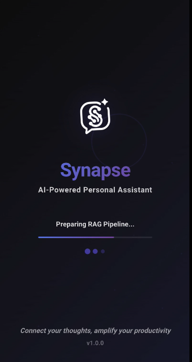
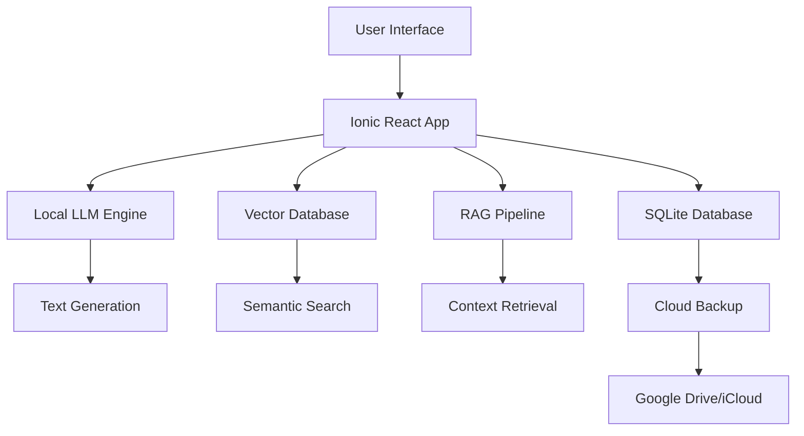
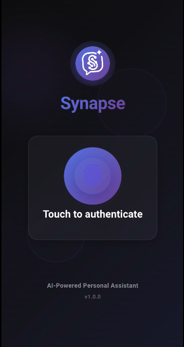
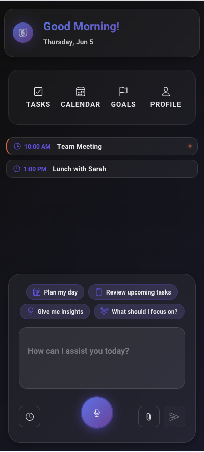

<div align="center">
  
  
  # Synapse
  
  **🧠 AI-Powered Personal Assistant That Lives in Your Pocket**
  
  [](https://ionicframework.com/)
  [](https://reactjs.org/)
  [](https://www.typescriptlang.org/)
  [](https://capacitorjs.com/)
  
  *Connect your thoughts, amplify your productivity*
  
  [🚀 Demo](#-demo) • [✨ Features](#-features) • [🛠️ Quick Start](#️-quick-start) • [🏗️ Architecture](#️-architecture) • [📱 Screenshots](#-screenshots)
</div>

---

## 🌟 What is Synapse?

Synapse is a **revolutionary client-side AI assistant** that brings the power of Large Language Models (LLMs) and Retrieval-Augmented Generation (RAG) directly to your mobile device. No servers, no subscriptions, no privacy concerns – just pure AI assistance that works offline and syncs seamlessly across your devices.

> **🎯 Think ChatGPT + Notion + Your Personal Brain, all running locally on your phone**

## ✨ Features

### 🤖 **Intelligent AI Assistant**
- **LLM-Powered Conversations**: Natural language interactions with advanced AI
- **RAG Pipeline**: Connects your conversations with relevant context and knowledge
- **Smart Suggestions**: Contextual prompts based on your usage patterns
- **Voice Input**: Speak naturally to your assistant
- **File Upload**: Analyze documents, images, and more

### 📱 **Complete Productivity Suite**
- **📋 Smart Task Management**: AI-assisted task creation and prioritization
- **📅 Intelligent Calendar**: Context-aware scheduling and planning
- **🎯 Goal Tracking**: Break down objectives with AI guidance
- **👤 Personal Profile**: Customized experience based on your preferences

### 🛡️ **Privacy & Data Control**
- **100% Client-Side**: All AI processing happens on your device
- **Local SQLite Database**: Your data never leaves your device
- **Vector Database**: Efficient similarity search for RAG
- **Cloud Backup**: Optional Google Drive/iCloud sync (encrypted)
- **No Tracking**: Zero telemetry, zero data collection

### 🎨 **Beautiful Design**
- **Modern UI**: Clean, intuitive interface with smooth animations
- **Dark/Light Themes**: Adaptive design that's easy on the eyes
- **Responsive**: Perfect experience across phones and tablets
- **Framer Motion**: Delightful micro-interactions

## 🚀 Demo

<div align="center">
  
</div>

### Key Interactions:
- 💬 **Natural Conversations**: "Help me plan my week"
- 📋 **Task Management**: "Create tasks from this meeting note"
- 📅 **Smart Planning**: "When should I schedule my dentist appointment?"
- 🎯 **Goal Setting**: "Break down my fitness goals into actionable steps"

## 🛠️ Quick Start

### Prerequisites
- **Node.js** 18+ 
- **npm** or **yarn**
- **iOS Simulator** or **Android Emulator** (for mobile testing)

### Installation

```bash
# Clone the repository
git clone https://github.com/yourusername/synapse.git
cd synapse

# Install dependencies
npm install

# Start development server
npm run dev

# Build for production
npm run build

# Run on mobile (iOS/Android)
npx cap run ios
npx cap run android
```

### 🎉 That's it! No backend setup, no API keys, no configuration needed.

## 🏗️ Architecture

### **Innovative Client-Side AI Stack**



### **Tech Stack**

| Layer | Technology | Purpose |
|-------|------------|---------|
| **Frontend** | Ionic + React + TypeScript | Cross-platform mobile UI |
| **AI Engine** | Local LLM (WebLLM/ONNX) | On-device text generation |
| **Database** | SQLite | Local data storage |
| **Vector DB** | Local Vector Store | Semantic search for RAG |
| **Animations** | Framer Motion | Smooth UI interactions |
| **Build** | Vite + Capacitor | Fast builds + native deployment |

### **RAG Pipeline Architecture**

1. **💾 Data Ingestion**: Documents, conversations, and user data
2. **🔍 Vectorization**: Convert text to embeddings locally
3. **📊 Storage**: Store vectors in local database
4. **🎯 Retrieval**: Find relevant context for user queries
5. **🤖 Generation**: Combine context with LLM for responses

## 📱 Screenshots

<div align="center">
  <table>
    <tr>
      <td align="center">
        <br>
        <b>Splash Screen</b>
      </td>
      <td align="center">
        <br>
        <b>Login Screen</b>
      </td>
      <td align="center">
        <br>
        <b>AI Dashboard</b>
      </td>
    </tr>
  </table>
</div>

## 🔧 Development

### **Project Structure**

```
synapse/
├── src/
│   ├── pages/               # Main app screens
│   ├── components/          # Reusable UI components
│   ├── contexts/            # React contexts
│   ├── services/            # AI, database, and sync services
│   └── utils/               # Helper functions
├── public/                  # Static assets and logos
└── capacitor.config.ts      # Mobile app configuration
```

### **Key Services**
- **🤖 AI Service**: Local LLM integration and RAG pipeline
- **💾 Database Service**: SQLite operations and migrations
- **☁️ Sync Service**: Cloud backup and restore
- **🔍 Vector Service**: Similarity search and embeddings

### **Available Scripts**
```bash
npm run dev        # Development server
npm run build      # Production build  
npm run preview    # Preview production build
npm run test.unit  # Run unit tests
npm run test.e2e   # Run E2E tests
npm run lint       # Code linting
```

## 🌟 Why Synapse?

| Traditional AI Apps | Synapse |
|---------------------|---------|
| ☁️ Cloud-dependent | 📱 Fully offline |
| 💰 Subscription fees | 🆓 Completely free |
| 🔒 Data privacy concerns | 🛡️ 100% private |
| 🌐 Internet required | ⚡ Works anywhere |
| 🎯 Generic responses | 🧠 Personalized intelligence |

## 🚀 Roadmap

- [ ] **🧠 Advanced AI Models**: Support for larger, more capable models
- [ ] **🔌 Plugin System**: Extensible architecture for custom integrations
- [ ] **👥 Team Features**: Shared knowledge bases and collaboration
- [ ] **📊 Analytics Dashboard**: Personal productivity insights
- [ ] **🌍 Multi-language**: Support for multiple languages
- [ ] **⌚ Wearable Support**: Apple Watch and WearOS apps

## 🤝 Contributing

We welcome contributions! Whether it's:

- 🐛 **Bug fixes**
- ✨ **New features** 
- 📝 **Documentation improvements**
- 🎨 **UI/UX enhancements**

### **Getting Started**
1. Fork the repository
2. Create a feature branch: `git checkout -b feature/amazing-feature`
3. Commit changes: `git commit -m 'Add amazing feature'`
4. Push to branch: `git push origin feature/amazing-feature`
5. Open a Pull Request

## 📄 License

This project is licensed under the MIT License - see the [LICENSE](LICENSE) file for details.

## 🙏 Acknowledgments

- **Ionic Team** - For the amazing cross-platform framework
- **React Team** - For the powerful UI library
- **Local AI Community** - For pushing the boundaries of client-side AI
- **Contributors** - Thank you for making Synapse better!

---

<div align="center">
  
  **⭐ If Synapse helped you, consider giving it a star!**
  
  [](https://github.com/yourusername/synapse/stargazers)
  
  Made with ❤️ by [Your Name](https://github.com/yourusername)
  
</div> 